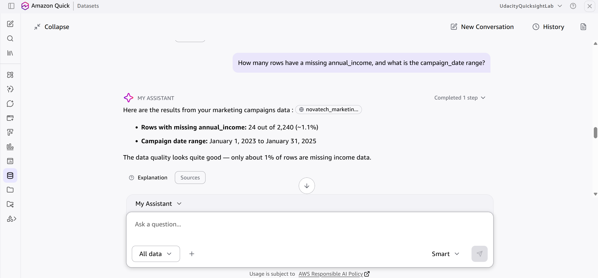
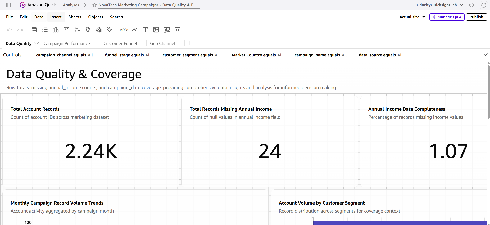
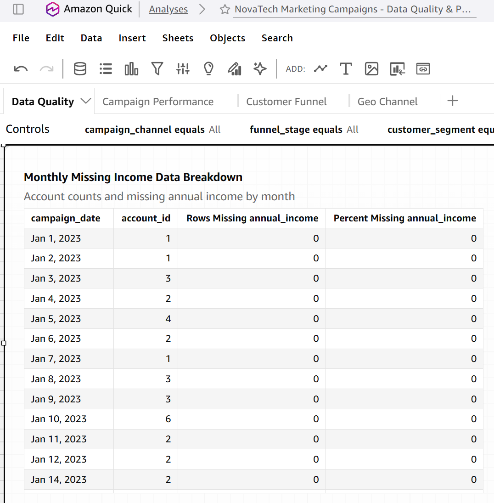
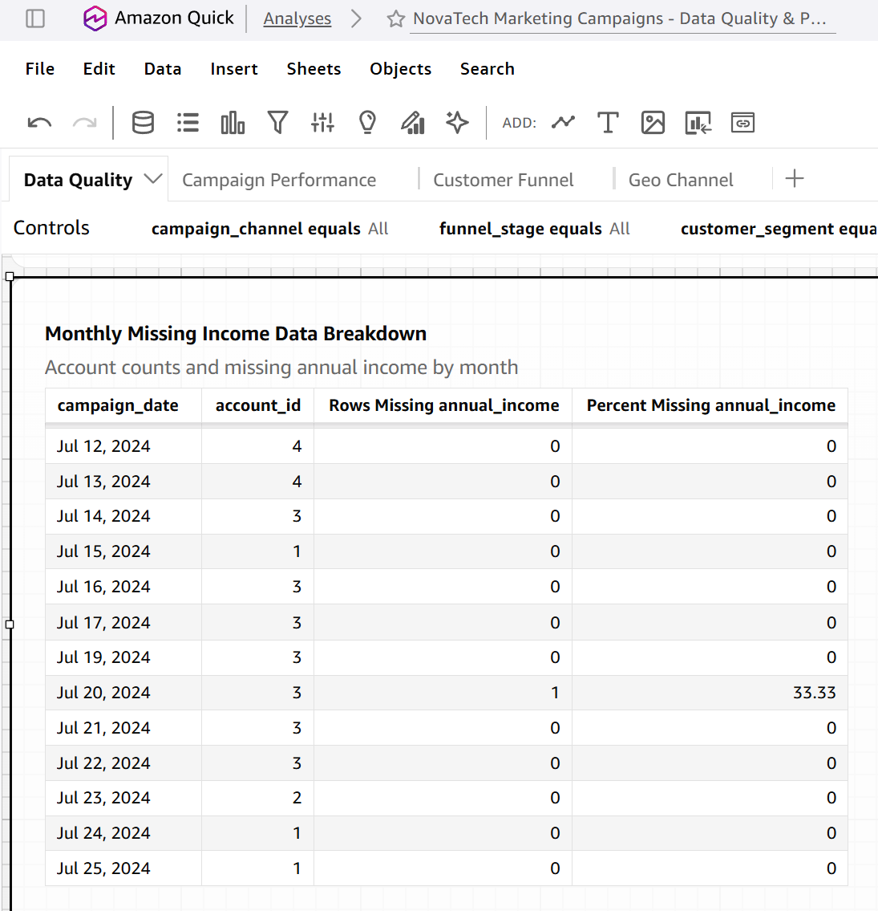
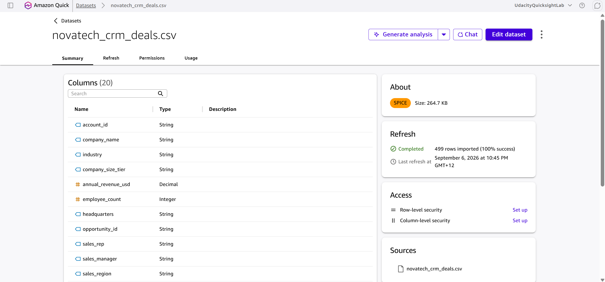
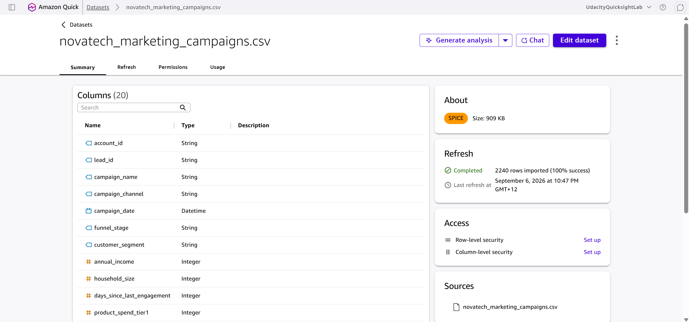
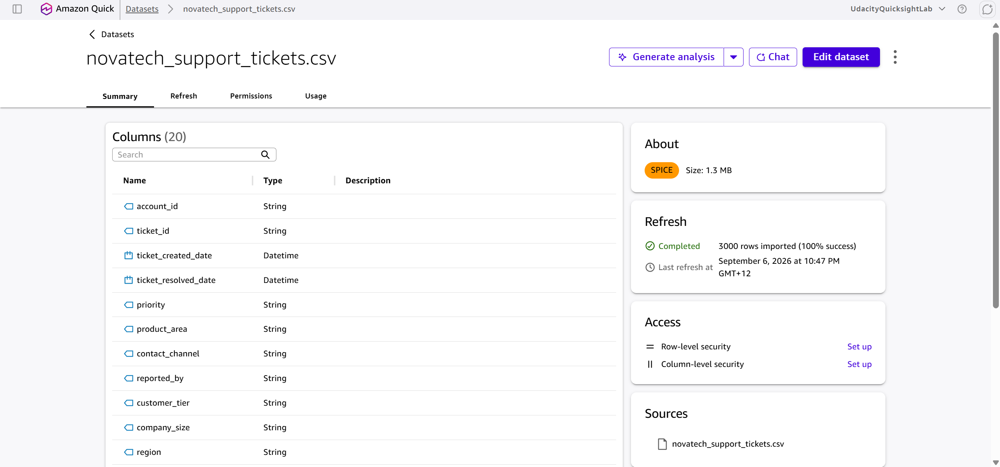

# NovaTech Data Verification Log

- **Student:** Eric Jang
- **Date:** 2026-09-06
- **Purpose:** Compare Amazon Q responses with independently checked CSV results and dashboard evidence.

## Verification Log

| # | Knowledge Base | Question Asked | Expected Answer | Q's Actual Answer | Match? | Notes |
|---|----------------|---------------|-----------------|-------------------|--------|-------|
| 1 | NovaTech CRM Deals | How many deals are in the data, and how many are won versus lost? | 499 total; 315 won; 184 lost | 499 total; 315 won; 184 lost | Yes | Compared the CSV result with Q's response. |
| 2 | NovaTech CRM Deals | How many unique accounts are there, and what is the account ID range? | 85 unique accounts; `ACCT-001` to `ACCT-085` | 85 unique accounts; `ACCT-011` to `ACCT-85` | No | Q returned the correct unique count but an incorrect and inconsistently formatted ID range. |
| 3 | NovaTech CRM Deals | What are the earliest and latest `deal_created_date` values? | 2023-06-17 to 2025-01-25 | 2023-06-17 to 2025-01-25 | Yes | Compared the CSV result with Q's response. |
| 4 | NovaTech Marketing Campaigns | How many leads are there, and how many responded to a campaign? | 2,240 leads; 609 responded (27.2%); 1,631 did not respond (72.8%) | 2,240 leads; 609 responded (27.2%); 1,631 did not respond (72.8%) | Yes | In the source data, `campaign_response` uses 1 for responded and 0 for did not respond. |
| 5 | NovaTech Marketing Campaigns | How many campaign channels exist, and what are they? | Five: Partner Referral, Organic Search, Paid Social, Email, and Direct Mail | Five: Partner Referral, Organic Search, Paid Social, Email, and Direct Mail | Yes | Compared the CSV result with Q's response. |
| 6 | NovaTech Marketing Campaigns | How many rows have missing `annual_income`, and what is the `campaign_date` range? | 24 of 2,240 rows (1.1%); 2023-01-01 to 2025-01-31 | 24 of 2,240 rows (1.1%); 2023-01-01 to 2025-01-31 | Yes | Compared the CSV result with Q's response. |
| 7 | NovaTech Support Tickets | How many tickets are there, and how many are in each priority level? | 3,000 total; 1,500 low; 1,050 medium; 400 high; 50 critical | 3,000 total; 1,500 low; 1,050 medium; 400 high; 50 critical | Yes | Compared the CSV result with Q's response. |
| 8 | NovaTech Support Tickets | How many tickets have no resolved date? | 59 tickets (2.0%) | 59 tickets (2.0%) | Yes | Compared the CSV result with Q's response. |
| 9 | NovaTech Support Tickets | What are the product areas, and which has the most tickets? | Six areas; Notifications has the most tickets with 601 (20.0%). | Six areas; Notifications has the most tickets with 601 (20.0%). | Yes | The six areas are Notifications, Analytics Dashboard, Authentication, Mobile App, Billing, and Data Pipeline. |

## Additional source-data checks

- `lead_id` is unique across all 2,240 marketing rows.
- CRM has 499 rows but 496 distinct `opportunity_id` values. Three IDs each occur twice: `OPP-44760`, `OPP-82512`, and `OPP-98039`.
- Support has 3,000 rows but 2,996 distinct `ticket_id` values. Four IDs each occur twice: `TKT-284055`, `TKT-634299`, `TKT-679459`, and `TKT-946331`.
- These duplicate identifiers were retained because the source CSV files were not modified. Dashboard totals should be labelled as record counts unless a distinct-count measure is used.

## Dashboard cross-check example

- **Fact checked:** Number of rows with missing `annual_income` and the overall `campaign_date` range.
- **Q response:** 24 missing values and a date range from 2023-01-01 to 2025-01-31.

- **Dashboard evidence:** The KPI confirms 24 missing values. The monthly table displays all campaign dates and the missing-value count for each date.

- **Conclusion:** Partially consistent. The missing-value count matches, but the dashboard screenshots do not independently validate the date range of the missing-income subset because the table includes dates with and without missing values.

## Imported CSV datasets

**`novatech_crm_deals.csv`**

**`novatech_marketing_campaigns.csv`**

**`novatech_support_tickets.csv`**

