# NovaTech Data Transformation and Join Log

- **Student:** Eric Jang
- **Date:** 2026-09-06
- **Purpose:** Document type corrections, calculated fields, account-level aggregation, joins, and SPICE storage.

## 1. Data Type Correction

I used the **Change data types** step to correct fields that were inferred incorrectly. For example, `annual_revenue_usd` and `deal_value` in the CRM dataset contain decimal values and were changed from integer to decimal.

**CRM Deals Dataset**
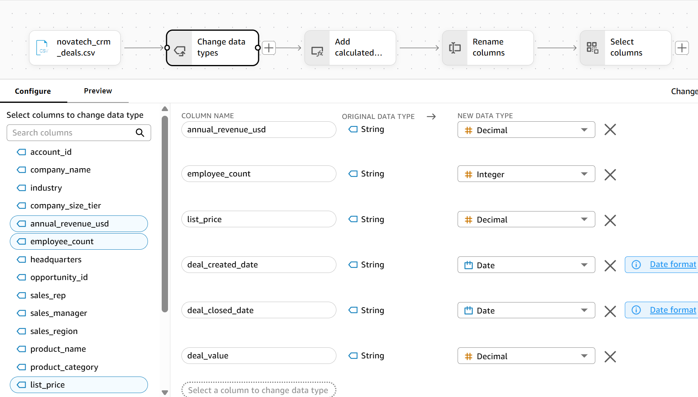

**Marketing Campaign Dataset**
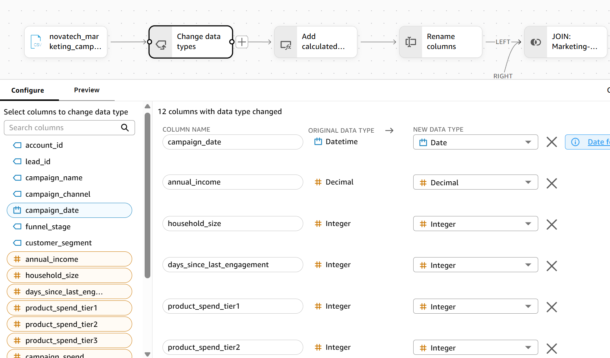

**Customer Health Dataset**
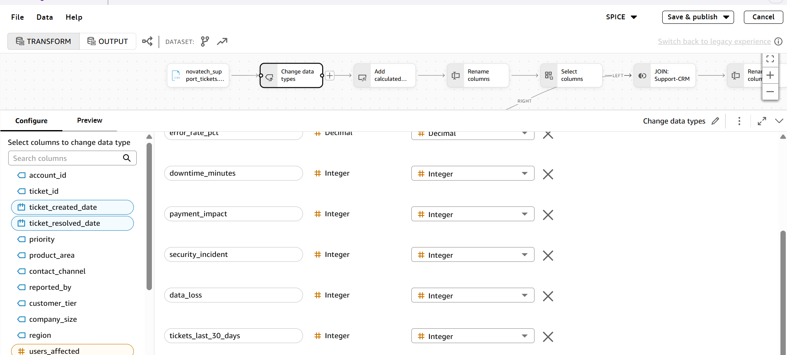

## 2. Calculated fields

I created calculated fields in each dataset to support the required KPIs and visuals. These include revenue and outcome measures for CRM, response and conversion measures for marketing, and resolution-time, severity, and risk measures for support.

**CRM Deals Dataset**
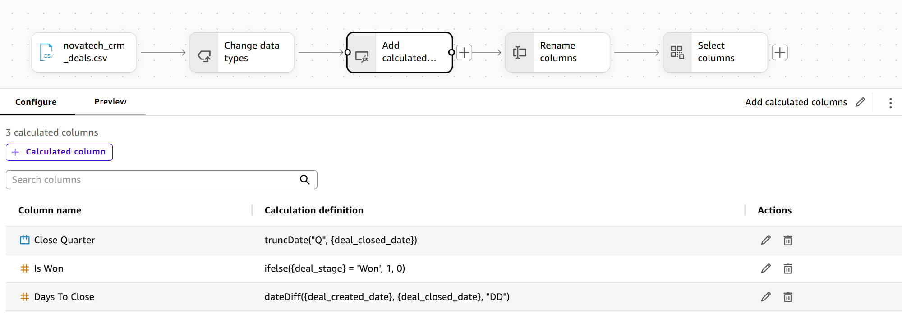

**Marketing Campaign Dataset**
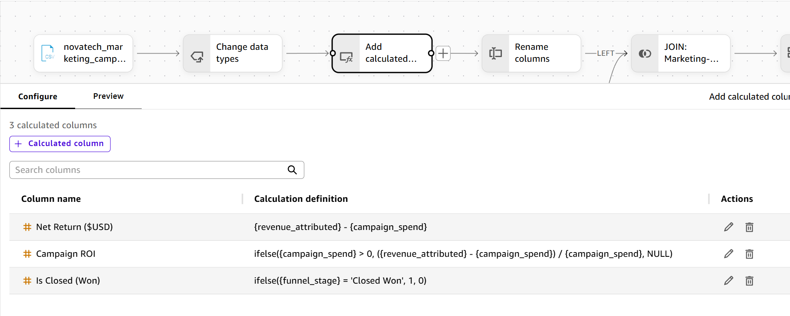

**Customer Health Dataset**
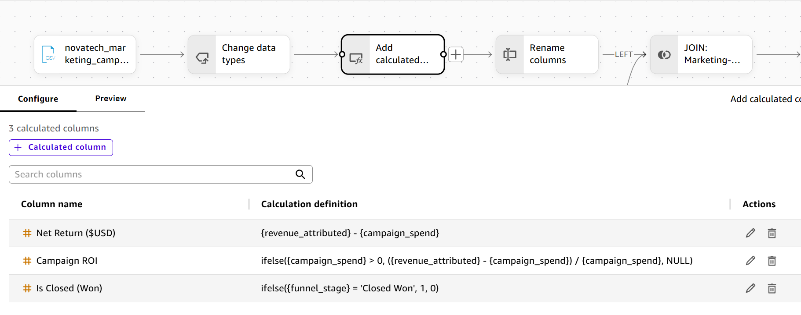

## 3. Unified dataset

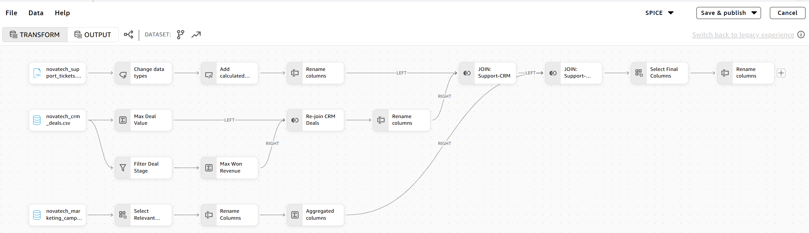

The unified dataset supports the Customer Health view by connecting support activity with account-level CRM and marketing measures. `account_id` is the common join key. The support-ticket dataset is the left-side table, so the resulting grain is one row per support ticket and all 3,000 support rows are retained.

### Join strategy

Directly joining the raw files would create a many-to-many row expansion because each account can have multiple deals, marketing leads, and tickets. To prevent that expansion, I first reduced the CRM and marketing datasets to one summary row per account. I then left-joined those summaries to the 3,000-row support-ticket dataset.

**CRM Deals Transformation**
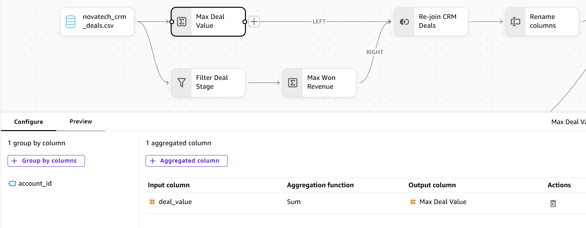
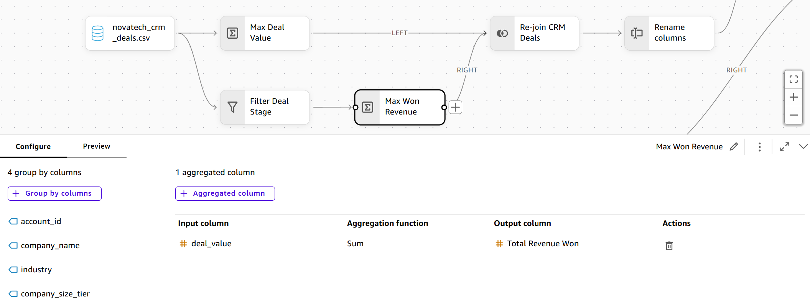

Starting from the raw CRM dataset, I created two account-level summaries:

- **Total Deal Value:** sum of `deal_value` by `account_id`.
- **Total Revenue Won:** sum of `deal_value` by account after filtering `deal_stage` to `Won`.

I rejoined the two summaries on `account_id`. The transformation step shown as **Max Deal Value** is labelled inconsistently in the interface screenshot; its configured aggregation is **Sum**.

**Marketing Campaign Transformation**
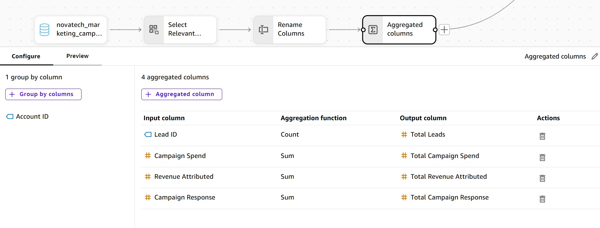

I aggregated the marketing data by `account_id` to calculate lead count, total campaign spend, total attributed revenue, and total campaign responses.

The CRM and marketing summaries each contain one row per account. Joining those summaries to the ticket-level support data preserves the support grain and produces 3,000 rows.

> **Grain limitation:** Account-level CRM and marketing values repeat on every support-ticket row for the same account. These fields must be aggregated once per account, such as with `max`, before they are totalled across accounts. Summing them across ticket rows will overstate revenue, spend, leads, and responses.

**First left join: Support Tickets to the CRM account summary on `account_id`.**

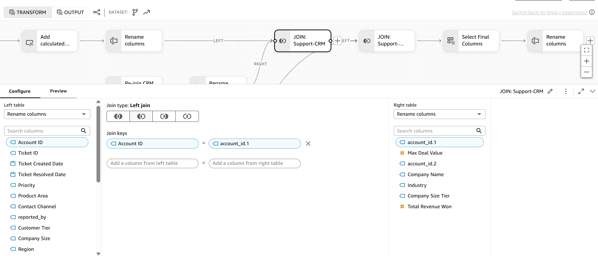

**Second left join: the first joined result to the marketing account summary on `account_id`.**

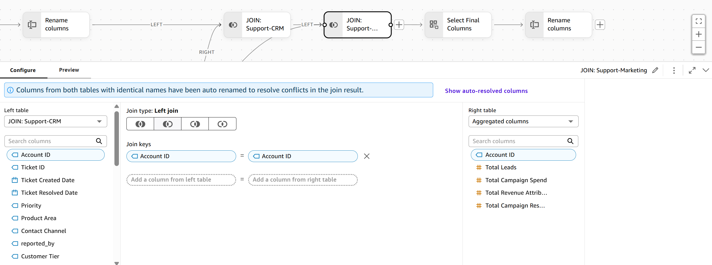

## 4. SPICE confirmation

All four datasets were saved to SPICE.

**Amazon Quick Datasets Tab**
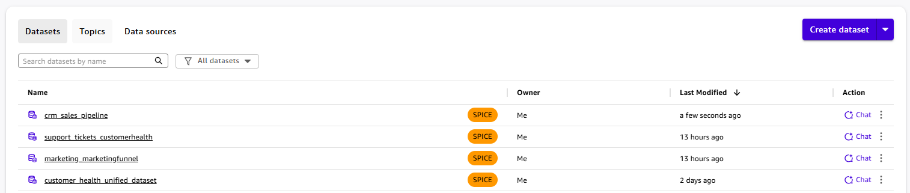

**CRM Deals Dataset**
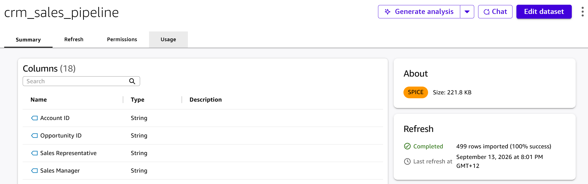

**Marketing Campaign Dataset**
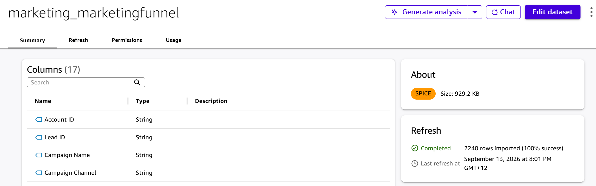

**Customer Health Dataset**
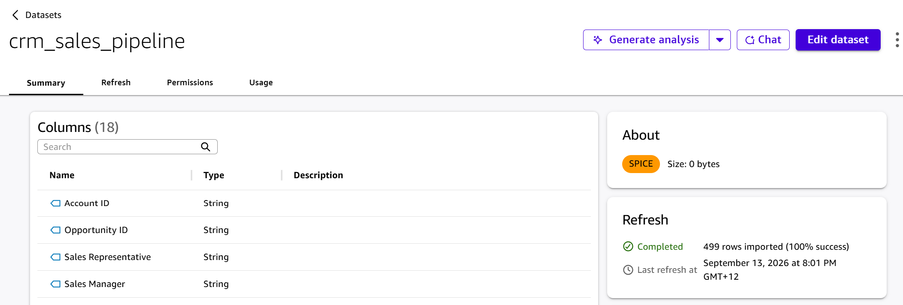

**Unified Dataset**
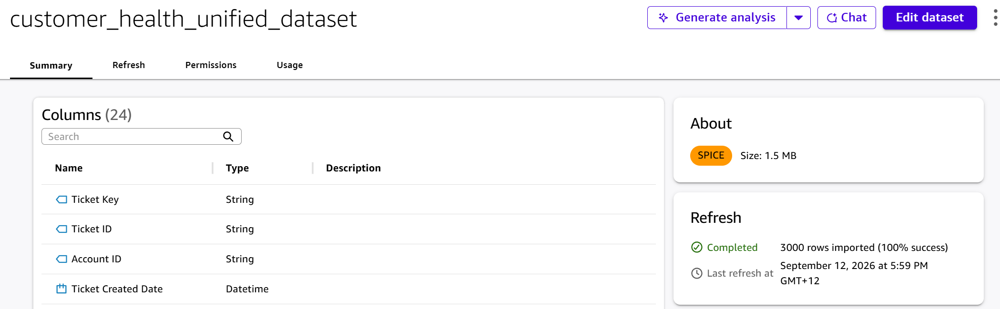
